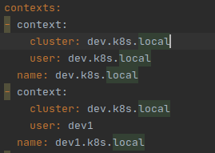

## Introduction 
This project demonstrates setting up a new user on a kops cluster and restrict the permissions granted to this user using RBAC. The default user created by Kops is a member of the admin group, meaning that it has full access to the cluster. To lower blast radius, it is common to create users that have a limited set of permissions that lets them perform well-defined actions such as creating pods in a certain namespace but are restricted from cluster-level access that may impact other users. 
 
 There are two aspects to Identity and Access Management (IAM)--Authentication, i.e., who am I, and authorization, i.e., what am I allowed to do. While authenticating with Kubernetes, a user presents a signed certificate that contains the username and group associations. From there, Role Based Access Control (RBAC) sub-system determines whether the user is authorized to perform a specific operation on a resource.
 
 If you are unfamiliar with certificates and TLS in general, I recommend these tutorials:
 - [tutorial 1](https://medium.com/talpor/ssl-tls-authentication-explained-86f00064280)
 - [tutorial 2](https://cheapsslsecurity.com/blog/what-is-ssl-tls-handshake-understand-the-process-in-just-3-minutes/)
 
 Note that TLS is generally used to verify the authenticity of a server, however it can also by a client to authenticate to a server and that's how we use it here. 
 
This tutorial assumes you have a [kops](https://kops.sigs.k8s.io/) cluster up and running. Open command prompt on your computer and run `kubectl get nodes`. You should see the nodes that are part of your cluster. For this information exchange to happen, the kubectl program first performs a TLS handshake using the current context to authenticate. If the user (or group/org) corresponding to the current context is authorized to perform a list nodes operation, the Kubernetes API server will respond with a list of nodes. 

To see the current context, run `kubectl config current-context`. Now open your kubernetes cluster config file (located by default on ~/.kube directory on Ubuntu) and look at the contents. You should see sections such as these:



Note the user corresponding to your current context. Towards the bottom of the config file, there should be a section associated with this user. Copy the value of the `client-certificate-data` field from that section to a file (say `tmp.crt`) and run the following python script to see the contents of the certificate. 
```angular2
decode_cert tmp.crt
```
It should print something like:
```angular2
<Name(O=system:masters,CN=kubecfg-Ankur)>
``` 
This means that this certificate belows to the organization (also called group) system:masters and common name kubecfg-Ankur. The common name will likely be different in your case. So this is the information presented by kubectl client to Kubernetes during Authentication. Now, let's find out the permissions associated with this user and/or group.

To find out the permissions associated with the group system:masters, use the following script to find all ClusterRoleBindings (CRBs) that have 'masters' in the Group key of the Subjects field
```angular2
kubectl get rolebindings,clusterrolebindings   --all-namespaces    -o custom-columns='KIND:kind,NAMESPACE:metadata.namespace,NAME:metadata.name,ACCOUNTS:subjects[?(@.kind=="Group")].name' | grep masters
```
You should see the cluster-admin CRB as the output. Upon doing a describe on this CRB, you can see that it is associated with the cluster-admin ClusterRole, which has full access to all resources on the cluster. So that's how kubectl is able to print a list of nodes in your cluster! For more information about CRBs and ClusterRoles, see [Using RBAC Authorization](https://kubernetes.io/docs/reference/access-authn-authz/rbac/) in the Kubernetes documentation

With this understanding in place, let's first create a new user called 'dev1' in the 'dev' group. Then, we'll create a Role and RoleBinding that will give a limited set of permissions to this user in the development namespace.

### Creating a new user
Creating a new user involves the steps listed below. This is standard off-line procedure required for TLS. If you are unfamiliar with TLS and SSL, I recommend [this](https://medium.com/talpor/ssl-tls-authentication-explained-86f00064280) blog.

1. Use the openssl utility to create a private key. This key will not be passed to anyone over the network, just used to decrypt messages received from the API server during the TLS handshake. This key also contains the public key which will be passed to the API server to generate a signed certificate. You can extract this public key by running `python decode_pem.py --file <filename>`. Note that there is no user or organization information in this key. This information will be added in the next step when we generate a certificate signing request. 

2. Use the openssl utility to generate a [Certificate Signing Request](https://www.globalsign.com/en/blog/what-is-a-certificate-signing-request-csr) (CSR). This CSR contains user specific information such as the common name, organization, country that the Certificate Authority (CA) will use to create your certificate. It also contains the public key that will be included in your certificate. The CSR connects user specific information with the key that we generated in step 1. 

3. Next, we'll create a certificate signing request YAML file corresponding to the new user from an existing template and replace the `request` key with the base64 encoded CSR generated in the previous step. Note that we use the Kubernetes kube-apiserver-client as the signer name. See [this](https://kubernetes.io/docs/reference/access-authn-authz/certificate-signing-requests/#signers) for a list of approved signers

4. Next, we'll create a CSR object in Kubernetes and sign it. During the signing process, the information in the CSR will be signed by the certificate issuer's (which in this case is the kube-apiserver-client) private key. This is the key step required to prevent man-in-the-middle attacks, as explained beautifully [here](https://medium.com/talpor/ssl-tls-authentication-explained-86f00064280). Note that Kubectl must be using a context that is authorized to sign CSRs. 

5. Once the CSR is approved, Kubernetes adds the certificate to the `certificate` field of the CSR object. We can read this string and store it in a CSR file. We also store the key created in step 1 to a file in base64 encoded format. 

The `create-user.sh` script included with this repo runs all these steps for you and saves the private key and signed certificate in the /certs directory. You can run this script like this:
```angular2
create-user.sh user-name group-name
``` 
Replace user-name and group-name with the desired user and group name. 

The next step is to populate the ~/.kube/config file with the contents of the key and certificate files. In the `users` section, create a new user (this doesn't have to be the same username as what you used while running create-user.sh, but good to keep the two consistent) and copy the contents of the key and crt files in the `client-key-data` and `client-certificate-data` respectively. Next, add a new context corresponding to this user in the contexts section.

Now, you should be able to switch to this context using `kubectl config use-context context-name`. After switching, try running any kubectl command such as kubectl get pods. You should get a Forbidden error message. This is because we haven't used RBAC to provide any permissions to the user we just created! Let's do this next. 

### USing RBAC to grant restricted permissions
Switch back to your usual kubernetes context with admin permissions and run `kubectl apply -f cluster-dev-users.yaml`. This yaml creates a namespace called development; a Role that allows "get", "watch", "list", "create" operations on pods and nodes in the development namespace; and a RoleBinding that attaches this Role to the dev1 user. Change the name of this user to whatever you used while creating the CSR in Step 2 above.

### Testing
Now switch back to the user specific context and try to create an nginx pod. You should be able to do it only in the development namespace.

I have also included a python script `test_user.py` that reads the user and cluster info from the Kubernetes config file corresponding to the context and cluster info specified in `user_settings.cfg` and uses urllib to communicate with the Kubernetes API server using TLS. This makes it clear what information is required for the SSL handshake to take place. As noted earlier, although the private key created in step 1 is one of the inputs to urllib's pool manager, this is only used to decode the message sent by the server to verify the client has the correct private key. The private key itself is never sent anywhere. 
 